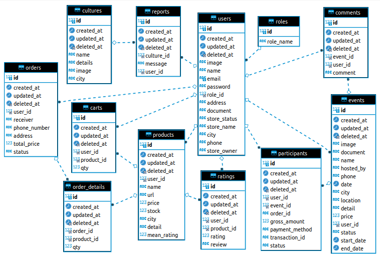

# Lami app

<!-- ABOUT THE PROJECT -->

## 💻 About The Project

Lami app provides various kinds of Indonesian cultural information, including catalogs, events and merchandise

Features in Lami app :

<div>
      <details>
<summary>🙎 Users</summary>
  
  <!---
  | Command | Description |
| --- | --- |
  --->
  
At users, there are features for login either user or admin, we also make CRUD for the user here
 
<div>
  
| Feature User | Endpoint | Param | JWT Token | Function |
| --- | --- | --- | --- | --- |
| POST | /register  | - | NO | new account registration |
| POST | /login | - | NO | login for user/admin |
| GET | /users | - | YES | read usre's profile |
| PUT | /users | - | YES | edit user's profile |
| DELETE | /users | - | YES | delete user's account |
| POST | /users/stores | - | YES | updgrade user account to UMKM |

</details>

<div>
      <details>
<summary>👨‍💻 Submission</summary>
  
  <!---
  | Command | Description |
| --- | --- |
  --->
  
At submissions, there are features for getting the  submission list of UMKM and event, and also the verification for the UMKM and event

⚠️ you have to log in with an account that has an admin role to access the submission features ⚠️

<div>
  
| Feature Admin | Endpoint | Param | JWT Token | Role | Function |
| --- | --- | --- | --- | --- | --- |
| GET | /stores/submissions | - | YES | admin |get the list of UMKM account submission list|
| PUT |  /stores/submissions | user id | YES | admin | update/verify UMKM account submission status |
| GET | /events/submissions | - | YES | admin | get the list of event submission list |
| GET | /events/submissions | event id | YES | admin | get the detail of event submission list |
| PUT | /events/submissions | event id | YES | admin | update/verify event submission status |

</details>  
       
</details>
       
<div>
      <details>
<summary>🍴 Cultures</summary>
  
  <!---
  | Command | Description |
| --- | --- |
  --->
  
At culutres, there are features for the culture management and report of culture
 
<div>
  
| Feature Restaurant | Endpoint | Param | JWT Token | Role | Function |
| --- | --- | --- | --- | --- |
| POST | /cultures  | - | YES | admin | create new culture |
| PUT | /cultures | - | YES | admin | edit the culture information |
| DELETE | /cultures | - | YES | admin | delete culture |
| GET | /cultures | - | NO | all | get list of cultures |
| GET | /cultures | culture id | NO | all | get the culture information detail |
| POST | /cultures/reports | culture id | YES | user, UMKM | insert report of culture |
| GET | /cultures/reports  | culture id | YES | admin | get report of culture |
</details>
       
<div>
      <details>
<summary>⭐ Events</summary>
  
  <!---
  | Command | Description |
| --- | --- |
  --->
  
At events, there are features for event management and information of event join management
 
<div>
  
| Feature Favourite | Endpoint | Param | Role | JWT Token | Function |
| --- | --- | --- | --- | --- | --- |
| POST | /events  | - | YES | user, UMKM | insert event submission |
| GET | /events | - | NO | all | get a list of events that have been approved by the admin |
| GET | /events | event id | NO | all | get detail information of event |
| DELETE | /events | event id | YES | user, UMKM | delete user's event |
| GET | /users/events | event id | YES | user, UMKM | get a list of user's events |
| POST | /events/participants | - | YES | user, UMKM | join event |
| GET | /events/participants | - | YES | user, UMKM | get a list of joined event |
| POST | /events/comments | - | YES | user, UMKM | create payment for join event |
| GET | /events/comments | event id | NO | all | get list of comment in event |
| POST | /events/payments | - | YES | user, UMKM | create payment for join event |
| GET | /events/payments/status | - | YES | user, UMKM | get payment status |
| GET | /events/payment_details | - | YES | user, UMKM | get payment detail |
| GET | /events/attendees | event id | YES | user, UMKM | get list of event attendees in pdf |

</details>

<div>
      <details>
<summary>💭 Products </summary>
  
  <!---
  | Command | Description |
| --- | --- |
  --->
  
At Products, there are features for product management, cart, order and rating product 
 
<div>
  
| Feature Comment & Rating | Endpoint | Param | JWT Token | Role | Function |
| --- | --- | --- | --- | --- | --- |
| POST | /products  | - | YES | UMKM | insert product for UMKM |
| GET | /products | - | NO | all | get all products |
| GET | /products | product id | NO | all | get product detail |
| PUT | /products | product id | YES | UMKM | edit product detail |
| DELETE | /products | product id | YES
| GET | /carts | - | YES | user, UMKM | get cart information |
| PUT | /carts | cart id | YES | user, UMKM | edit product quantity in cart |
| DELETE | /carts | cart id | YES | user, UMKM | delete product from cart |
| POST | /orders | - | YES | user, UMKM | insert order product |
| GET | /orders | - | YES | user, UMKM | get history order |
| POST | /products/ratings | product id | YES | user, UMKM | add product rating and review  |
| GET | /products/ratings | product id | NO | all | get product rating and review |

</details>   
       
### 🛠 &nbsp;Build App & Database


## 🗃️ ERD



## Run Locally

Clone the project

```bash
  git clone https://github.com/alta-capstone-groupproject2/backend.git
```

Go to the project directory

```bash
  cd backend
```

## Open Api

if you want to consume our api,
here's the way !

```bash
https://app.swaggerhub.com/apis-docs/Alfin7007/lamiApp/1.0
```

## Authors

- Alfin Fernandha Pratama
  [](https://www.linkedin.com/in/alfinfernandha/)
  [](https://github.com/Alfin7007)

- Muhamad Yusup
  Reach me:
  [](https://www.linkedin.com/in/muhamad-yusup-a69225234/)
  [](https://github.com/syawaladiyaksa15)

- Faza Muttaqien
  Reach me:
  [](https://github.com/faza-muttaqien)

 <p align="right">(<a href="#top">back to top</a>)</p>
<h3>
<p align="center">:copyright: 2022 | Built with jerih payah dan keringat kami bertiga  </p>
</h3>
<!-- end -->
